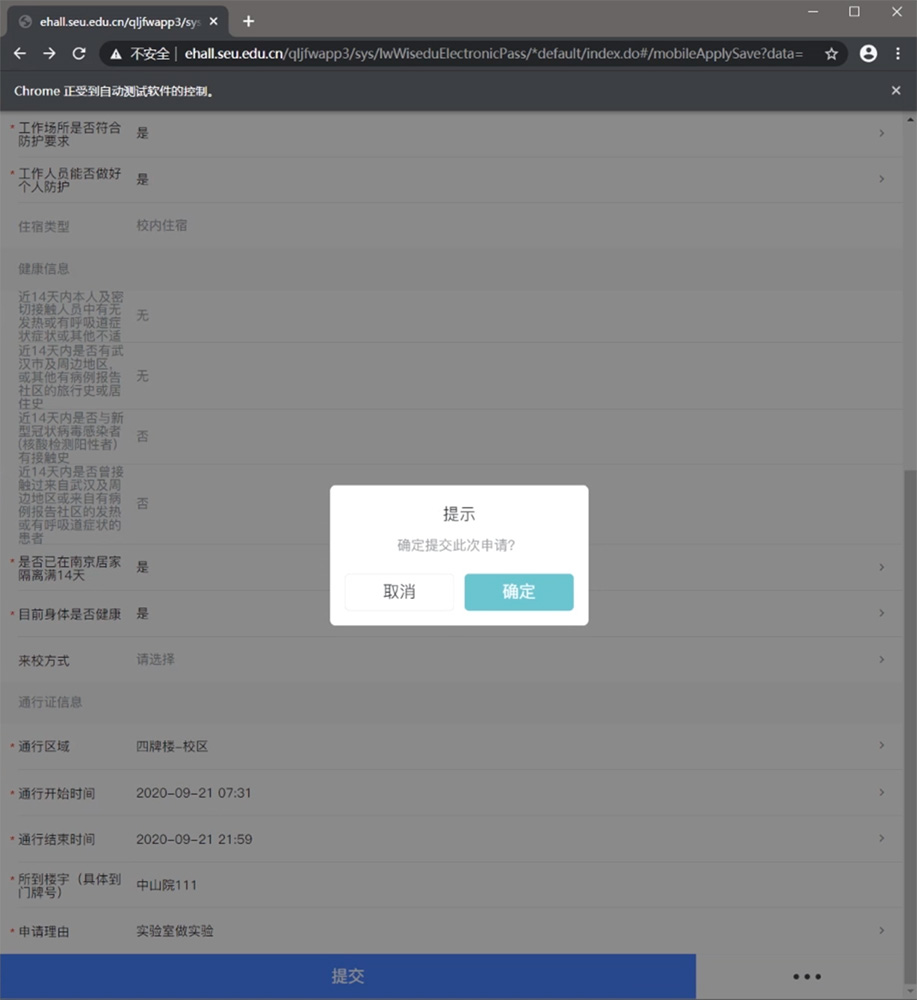
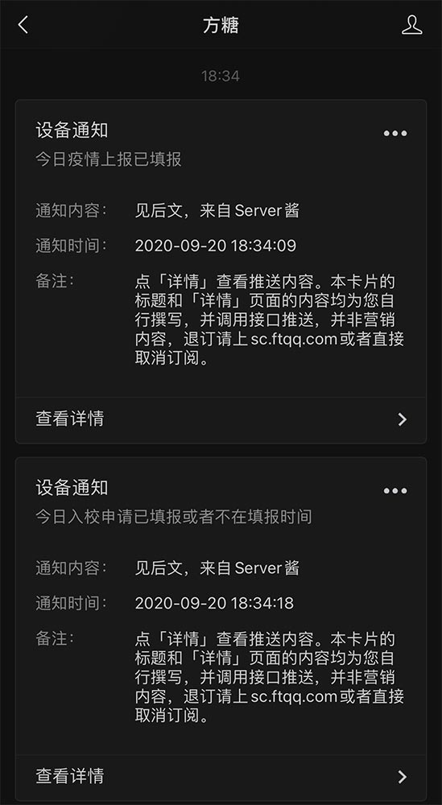

# [东南大学](https://www.seu.edu.cn) 疫情每日上报及入校申请自动化脚本

> 免责声明：本脚本仅为个人为学习python之目的所编写，使用该脚本造成的一切后果均由使用者承担。
>
> 本人仍然提倡每日按时手动进行疫情上报与入校申请，配合学校进行好疫情防控。



# 使用方法：

## 1. 下载WebDriver
推荐使用 [Google Chrome](https://www.google.cn/chrome/) 作为本脚本使用的浏览器，本文档后面也将以Google Chrome作为示范。

首先请检查您安装的Chrome版本：浏览器右上角3个点-帮助-关于Google Chrome。

接下来，进入 [淘宝Chrome Driver镜像站](http://npm.taobao.org/mirrors/chromedriver/) 下载与您使用浏览器相同版本的Chrome Driver。

下载后请与本脚本文件放置于同一目录中, Windows平台命名为`Chromedriver.exe`, Linux/macOS平台命名为`chromedriver`。

## 2. 下载`python`依赖
本脚本依赖`selenium`包与`requests`包。要安装它们，只需要使用`pip`即可。

```shell script
pip3 install requests selenium -i https://pypi.douban.com/simple --user
```

## 3. 配置脚本
复制目录中的`config_sample.py`，并重命名为`config.py`。

打开`config.py`，向其中的`username`与`password`后填入你的一卡通账号与密码。

您还可以在其中的`temp_range`中自定义您想要填写的体温范围。 ***请一定要在确定自己体温正常的情况下使用此功能。***

在`places`与`reasons`中您还可以自定义您每日想要填写的入校区域与入校理由，其中每个元组的第一个元素为周一，最后一个元素为周日。

`reasons`的取值`0-7`所对应的理由如下所示。

|          理由          | 对应数字 |
| :--------------------: | :------: |
|      到教学楼上课      |    0     |
|      实验室做实验      |    1     |
|      到办公室科研      |    2     |
|    到图书馆学习借书    |    3     |
| 到职能部门、院系办手续 |    4     |
|          开会          |    5     |
|    往返无线谷实验室    |    6     |
|          其他          |    7     |

## 4. 使用 [server酱](http://sc.ftqq.com/) 接收脚本执行结果
[server酱](http://sc.ftqq.com/) 是一个微信推送工具，可以将服务器端执行结果推送到您的微信上。



本脚本支持 [server酱](http://sc.ftqq.com/) 推送，您只需要按照其网站使用`GitHub`注册账号并扫码绑定您的微信，
最后将取得的`SCKEY`填入`config.py`中的`server_chan_key`，即可启用微信推送功能。

> 默认将`server_chan_key`留空，即可禁用微信推送功能。

## 5. 运行脚本
运行`main.py`即可。