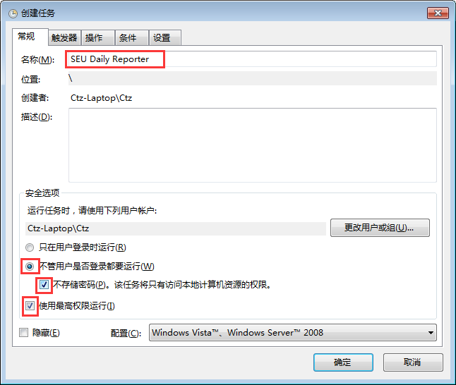
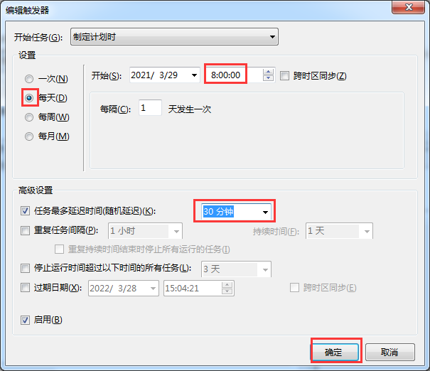
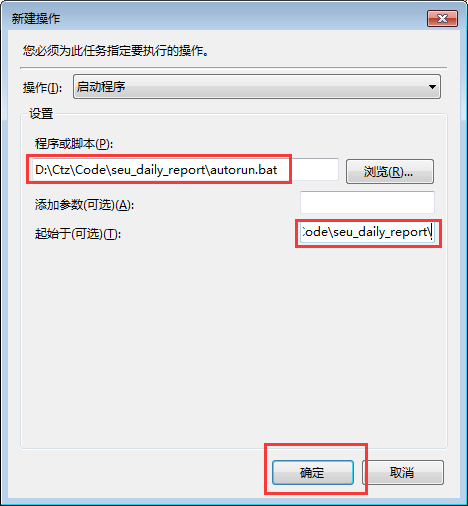

# [东南大学](https://www.seu.edu.cn) 每日健康上报及入校申请自动化脚本

> 免责声明：本脚本仅为个人为学习python之目的所编写，使用该脚本造成的一切后果均由使用者承担。
>
> 本人仍然提倡每日按时手动进行疫情上报与入校申请，配合学校进行好疫情防控。

这是一个每日健康上报及入校申请自动化脚本，通过正确配置之后，可以实现每日自动健康上报和入校申请，并通过微信或邮件推送上报结果。

# 一、依赖
## 1. WebDriver
**如果你用的浏览器是[Google Chrome](https://www.google.cn/chrome/) ，那么**

1. 请检查安装的Chrome版本：浏览器右上角的3个点-帮助-关于Google Chrome。

2. 进入 [淘宝Chrome Driver镜像站](http://npm.taobao.org/mirrors/chromedriver/) 下载与浏览器相同版本的Chrome Driver。

3. 下载后与本脚本文件放置于同一目录中,Windows平台命名为`chromedriver.exe`。

   Linux / macOS平台请将可执行文件放置于与脚本相同的目录中，并自行修改脚本中`executable_path`中的文件名。

**如果你用的浏览器是 [Mozilla Firefox](https://www.firefox.com ) ，那么**

1. 请检查安装的Firefox版本：浏览器右上角3条杠-帮助-关于Firefox。

2. 进入 [淘宝geckodriver镜像站 ](http://npm.taobao.org/mirrors/geckodriver/)下载与浏览器相同版本的geckodriver。

3. 下载后与本脚本文件放置于同一目录中, Windows平台命名为`chromedriver.exe`。

   Linux / macOS平台请将可执行文件放置于与脚本相同的目录中，并自行修改脚本中`executable_path`中的文件名。

> 提示：本脚本目录中已经放置`chromedriver_90.0.4430.24`和`geckodriver_v0.29.0`，若运行有问题，请下载与浏览器相同版本的WebDriver进行替换。

## 2. `Python`依赖
本脚本依赖`selenium`包与`requests`包，使用`pip`进行安装。

```shell script
# Windows
pip install requests selenium -i https://pypi.douban.com/simple --user
# unix-python3
pip3 install requests selenium -i https://pypi.douban.com/simple --user
```


# 二、使用方法
## 1. 配置脚本

1. 将脚本目录中的`config_sample.json`重命名为`config.json`。

2. 打开`config.json`，根据需求填写相关字段，字段描述如下。
   | 字段名                      | 描述                                      | 是否必填 |
   | --------------------------- | ----------------------------------------- | -------- |
   | `username`                  | 一卡通账号（9位）                         | YES      |
   | `password`                  | 一卡通密码                                | YES      |
   | `temp_range`                | 体温范围                                  | YES      |
   | `places`                    | 申请入校区域                              | NO       |
   | `reasons`                   | 申请入校理由                              | NO       |
   | `server_chan_key`           | Server酱SCKEY                             | NO       |
   | `from_addr`                 | 发送执行结果的邮箱地址（建议使用SEU邮箱） | NO       |
   | `email_password`            | 发送邮箱密码                              | NO       |
   | `smtp_server`               | 发送邮箱的SMTP服务器地址                  | NO       |
   | `to_adr`                    | 接收执行结果的邮箱地址                    | NO       |
   | `enable_enter_campus_apply` | 开启/关闭入校申请功能（默认关闭）         | YES      |
   | `browser`                   | 选择浏览器类型（chrome / firefox）        | YES      |

   向其中的`username`与`password`填入您的一卡通账号与密码。

   在`temp_range`中可自定义您想要填写的体温范围。 ***请一定要在确定自己体温正常的情况下使用此功能。***
   
   在`places`与`reasons`中还可以自定义您每日想要填写的入校区域与入校理由，其中的第一个元素为周一，最后一个元素为周日。`reasons`的取值`0-7`所对应的理由如下所示。
   
   |          理由          | 对应数字 |
| :--------------------: | :------: |
|      到教学楼上课      |    0     |
|      实验室做实验      |    1     |
|      到办公室科研      |    2     |
|    到图书馆学习借书    |    3     |
| 到职能部门、院系办手续 |    4     |
|          开会          |    5     |
|    往返无线谷实验室    |    6     |
|          其他          |    7     |
   
   `server_chan_key`用于配置Server酱推送功能。
   
   `from_addr`、`email_password`、`smtp_server`、`to_addr`用于配置邮件推送功能。
   
   除此之外，通过将`enable_enter_campus_apply`设置为`true`来启动入校申请或`false`来关闭入校申请。
   
   `browser`用于设置使用的浏览器，可填写`chrome`或`firefox`

### 配置实现多个用户上报

若想要同时为多个用户进行健康上报或入校申请，只需要将`config.json`中`users`字段的配置信息复制多份，每一份均填写一位用户的信息即可。

例如：

```
"users": [
      {
         "username": "xxxxxx", "password": "***",
         "temp_range": [35.5, 36.2],
         "places": [],
         "reasons": [],
         "server_chan_key": "",
         "from_addr": "",
         "email_password": "",
         "smtp_server": "",
         "to_addr": ""
      },
        {
         "username": "xxxxxx", "password": "***",
         "temp_range": [35.1, 36.8],
         "places": [],
         "reasons": [],
         "server_chan_key": "",
         "from_addr": "",
         "email_password": "",
         "smtp_server": "",
         "to_addr": ""
      }
   ]
```

### 使用 Server酱 推送上报结果

[Server酱](http://sc.ftqq.com/) 是一个微信推送工具，可以将服务器端执行结果推送到您的微信上。

本脚本支持 server酱 推送，您只需要按照其网站上的指引，使用`GitHub`账号登录并扫码绑定您的微信，即可获得`SCKEY`。
将取得的`SCKEY`填入`config.json`中的`server_chan_key`字段中，即可启用微信推送功能。

> 提示：将`server_chan_key`留空，即可禁用微信推送功能。

### 使用 邮件 推送上报结果

本脚本支持邮件推送，您只需要在`config.json`文件中填写`from_addr`、`email_password`、`smtp_server`、`to_addr`字段。即可启用邮件推送功能。

例如：填写字段如下，则会使用SEU邮箱将脚本执行结果推送至指定邮箱

| 字段名           | 值              | 描述                   |
| ---------------- | --------------- | ---------------------- |
| `from_addr`      | xxx@seu.edu.cn  | 发送执行结果的邮箱地址 |
| `email_password` | ***             | 发送执行结果的邮箱密码 |
| `smtp_server`    | smtp@seu.edu.cn | 发送邮箱的SMTP服务器   |
| `to_addr`        | xxx@example.com | 接收邮箱地址           |

> 提示：将`from_addr`、`email_password`、`smtp_server`、`to_addr`留空，即可禁用邮件推送功能。

## 2. 运行脚本
在正式运行脚本之前，请确认脚本目录下的文件和下面相同：

```
|-- seu_daily_report
    |-- .gitignore
    |-- autorun.bat
    |-- chromedriver.exe
    |-- geckodriver.exe
    |-- config_sample.json
    |-- main.py
    |-- README.md
    |-- img
```

之后，使用`python`运行`main.py`或直接运行`auto.bat`（Windows平台下）即可。
您也可以将脚本与运行环境部署到云服务器上，并设置定时计划任务，实现每日自动上报。

下面介绍如何在Windows上设置实现每日自动上报。

1. `Ctrl + R`输入`taskschd.msc`，打开任务计划程序

2. 创建任务，在常规中名称填写`SEU Daily Reporter`，勾选【不管任务是否登录都要运行】、【不存储密码】、【使用最高权限运行】。

   

3. 新建触发器，设置为【每天】执行，设置【计划开始的时间】和【随机延迟时间】，点击确定。

   

4. 新建操作，填写【运行脚本所在的绝对路径】和【脚本所在目录】，点击确定。

   

5. 点击【确定】完成计划任务创建，即可实现每日自动上报。

