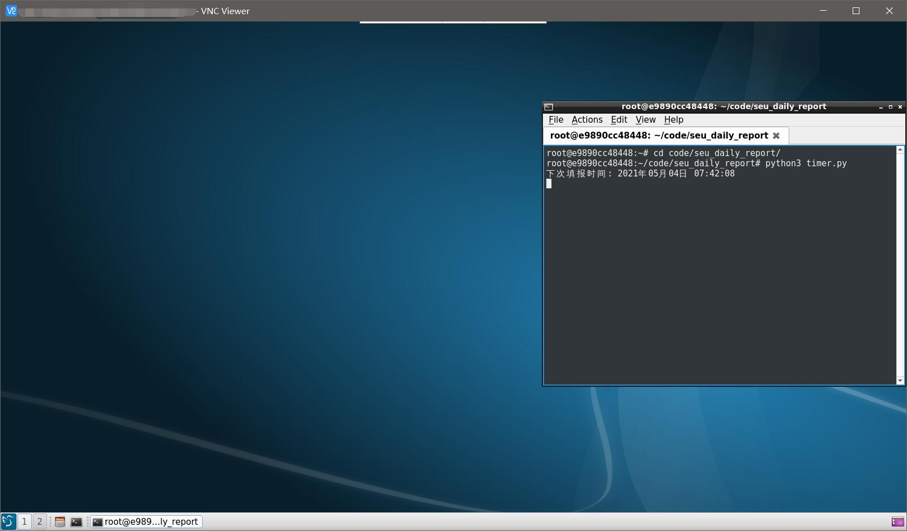

# [东南大学](https://www.seu.edu.cn) 疫情每日上报自动化脚本

> 免责声明：本脚本仅为个人为学习python之目的所编写，使用该脚本造成的一切后果均由使用者承担。
>
> 本人仍然提倡每日按时手动进行疫情上报与入校申请，配合学校进行好疫情防控。

这是一个每日健康上报的自动化脚本，通过正确配置之后，可以实现每日自动健康上报，并通过微信或邮件推送上报结果。

> ⚠ 仓库中最新的代码已经恢复了入校申请的功能，但由于上传通信行程码的功能使用了微信内置浏览器API，普通浏览器暂时无法模拟。
> 若您能够解决此问题，欢迎提出PR。同时，该功能处于默认*关闭*状态。

# 使用方法：

## 1. 下载WebDriver

**如果你用的浏览器是 [Google Chrome](https://www.google.cn/chrome/) ，那么**

1. 首先请检查您安装的Chrome版本：浏览器右上角的3个点-帮助-关于Google Chrome。

2. 进入 [淘宝Chrome Driver镜像站](http://npm.taobao.org/mirrors/chromedriver/) 下载与您使用浏览器相同版本的Chrome Driver。

3. 下载后请与本脚本文件放置于同一目录中, Windows平台命名为`Chromedriver.exe`。

**如果你用的浏览器是 [Mozilla Firefox](https://www.firefox.com) ，那么**

1. 请检查安装的Firefox版本：浏览器右上角3条杠-帮助-关于Firefox。

2. 进入 [淘宝geckodriver镜像站](http://npm.taobao.org/mirrors/geckodriver/) 下载与浏览器相同版本的geckodriver。

3. 下载后与本脚本文件放置于同一目录中, Windows平台命名为`geckodriver.exe`。

> 无需更改`WebDriver`的文件名，程序会自动识别各个平台对应的文件名。

## 2. 安装`python`依赖

本脚本依赖`selenium`包与`requests`包。要安装它们，只需要使用`pip`即可。

```shell
# Windows
pip install requests selenium -i https://pypi.douban.com/simple --user
# unix-python3
pip3 install requests selenium -i https://pypi.douban.com/simple --user
```

## 3. 配置脚本

1. 将脚本目录中的`config_sample.json`重命名为`config.json`。

2. 打开`config.json`，向各个字段中填入合适的值，每个字段的描述如下表所示。

3. [server酱](http://sc.ftqq.com/) 是一个微信推送工具，可以将服务器端执行结果推送到您的微信上。本脚本支持`server酱`推送，您只需要按照其网站上的指引，使用`GitHub`账号登录并扫码绑定您的微信，即可获得`SCKEY`。将取得的`SCKEY`填入`config.json`中的`server_chan_key`字段中，即可启用微信推送功能。
> 由于微信模板消息即将停用，`server酱`也将会停止微信推送服务。若需要使用`server酱`官方提供的其他推送通道，可以直接在`server酱`官网绑定新的推送通道，并将新的`SCKEY`填入。本程序中的接口无需更新。

4. 本脚本同样支持使用邮箱推送执行结果。在`config.json`中的`email_addr`字段填写接收邮件使用的邮箱，即可使用打卡所使用账号的东大邮箱发送一封邮件到该地址。

| 字段名                       | 描述                                                |
| --------------------------- | -------------------------------------------------- |
| `username`                  | 一卡通账号（9位）                                     |
| `password`                  | 一卡通密码                                           |
| `temp_range`                | 体温范围 ***请一定要在确定自己体温正常的情况下使用此功能*** |
| `server_chan_key`           | Server酱SCKEY（留空不启用）                           |
| `email_addr`                | 接收执行结果的邮箱地址（留空不启用）                     |
| `places`                    | 入校申请时周一到周日的入校区域                          |
| `reasons`                   | 入校申请时周一到周日的入校原因                          |
| `browser`                   | 选择浏览器类型（chrome / firefox）                    |
| `enter_campus_apply`        | 选择是否开启入校申请功能                               |

5. 在`places`与`reasons`中您还可以自定义您每日想要填写的入校区域与入校理由，其中的第一个元素为周一，最后一个元素为周日。

`reasons`的取值`0-7`所对应的理由如下所示。

|          理由         | 对应数字 |
| :------------------: | :-----: |
|      到教学楼上课      |    0    |
|      实验室做实验      |    1    |
|      到办公室科研      |    2    |
|     到图书馆学习借书    |    3    |
|  到职能部门、院系办手续  |    4    |
|          开会         |    5    |
|     往返无线谷实验室    |    6    |
|          其他         |    7    |

## 4. 运行脚本

在您正式运行脚本之前，请确认您脚本目录下存在`main.py` `config.json`与`chromedriver.exe`或`geckodriver.exe`文件。

然后，使用`python`/`python3`运行`main.py`即可启动单次填报，或运行`timer.py`以在每天7-8时随机时间自动运行填报脚本。

若想要同时为多个用户执行本脚本，只需要将`config.json`中`users`字段的配置信息复制多份，每一份均填写一位用户的信息即可。例如：
```
"users": [
      {
         "username": "xxxxxxxxx", "password": "********",
         "server_chan_key": "",
         "temp_range": [36.0, 36.5], "reasons": [1, 1, 1, 1, 1, 1, 1],
         "places": ["中心楼001", "中心楼001", "中心楼001", "中心楼001", "中心楼001", "中心楼001", "中心楼001"],
         "email_addr": ""
      },
      {
         "username": "xxxxxxxxx", "password": "********",
         "server_chan_key": "",
         "temp_range": [36.0, 36.5], "reasons": [1, 1, 1, 1, 1, 1, 1],
         "places": ["中心楼001", "中心楼001", "中心楼001", "中心楼001", "中心楼001", "中心楼001", "中心楼001"],
         "email_addr": ""
      }
   ]
```

## 5. 进阶

本脚本现已支在docker环境中运行。此处简单介绍如何在未安装图形界面的服务器上，使用docker安装支持桌面环境的镜像，并实现每日自动签到。

首先，使用docker拉下 [dorowu/ubuntu-desktop-lxde-vnc](https://hub.docker.com/r/dorowu/ubuntu-desktop-lxde-vnc/) 镜像。

```shell
docker pull dorowu/ubuntu-desktop-lxde-vnc:focal-lxqt 
```

然后，启动该容器并允许在`5900`端口上的VNC远程登录。其中，`VNC_PASSWORD`字段是VNC远程登录的密码，可以根据需要自行设置。

```shell
docker run -itd --name ubuntu-daily-report -p 5900:5900 \
    -e RESOLUTION=1600x900 -e VNC_PASSWORD=123456 \
    dorowu/ubuntu-desktop-lxde-vnc:focal-lxqt 
```

容器成功启动后，使用VNC远程连接容器内的操作系统，在操作系统内使用git拉下本仓库代码，并配置`config.json`。

最后，使用图形桌面的终端运行`timer.py`脚本即可。

```shell
python3 timer.py
```


